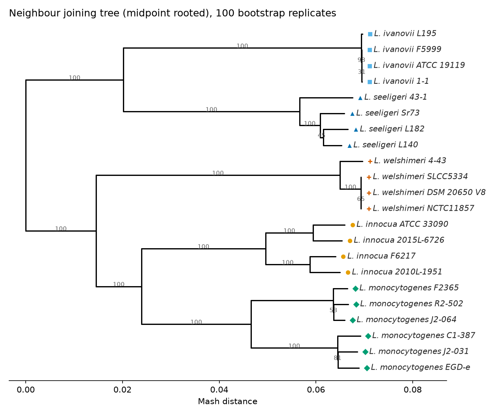
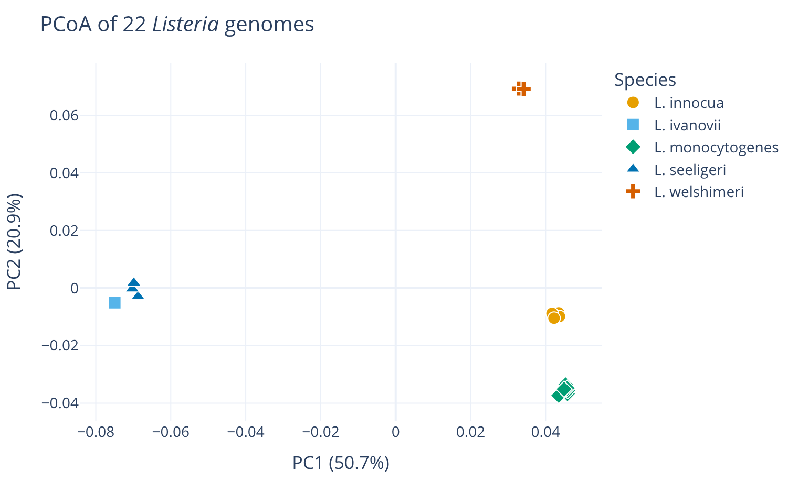
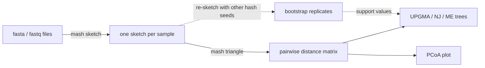

<p align="center">
  
</p>

<h1 align="center">genome_comparator</h1>

<p align="center">
  <a href="https://github.com/duceppemo/genome_comparator/actions/workflows/tests.yml"></a>
  <a href="https://github.com/duceppemo/genome_comparator/releases/latest"></a>
  <a href="https://codecov.io/gh/duceppemo/genome_comparator"></a>
  
  <a href="LICENSE"></a>
  <a href="https://github.com/duceppemo/genome_comparator/wiki"></a>
</p>

Quickly compare and visualize distances between genomes, from assemblies (fasta) or reads (fastq), using
[Mash](https://github.com/marbl/Mash). Produces a distance matrix, trees (UPGMA, neighbour joining, minimum
evolution) with optional bootstrap support, and an interactive PCoA plot.

<p align="center">
  
  
  <br>
  <sub>22 public <i>Listeria</i> genomes from the <a href="https://github.com/duceppemo/genome_comparator/wiki/Tutorial">tutorial</a>: 3 seconds, or under 2 minutes with 100 bootstrap replicates.</sub>
</p>

## Features
* **Assemblies or reads**: fasta or fastq (gzipped or not), paired-end reads combined per sample.
* **Fast and scalable**: thousands of genomes; sketches are computed in parallel and reused between runs.
* **Trees**: UPGMA, neighbour joining and minimum evolution, with optional **bootstrap support**.
* **Interactive PCoA** with metadata on hover and colourblind-friendly colouring by any metadata column.
* **Safe by default**: ambiguous sample names and unreadable files are reported, never silently merged or ignored.

## How it works


## Installation
```
git clone https://github.com/duceppemo/genome_comparator
cd genome_comparator
conda env create -f environment.yml
conda activate genome_comparator
pip install --no-deps .
```

## Quick start
```
mash-phylo -i /input/folder/ -o /output/folder/ --nj --pcoa
```

New to the tool? Follow the **[tutorial](https://github.com/duceppemo/genome_comparator/wiki/Tutorial)**: it downloads
22 public genomes and walks through every output in a few minutes.

## Documentation
The **[wiki](https://github.com/duceppemo/genome_comparator/wiki)** covers
[usage and options](https://github.com/duceppemo/genome_comparator/wiki/Usage),
[output files](https://github.com/duceppemo/genome_comparator/wiki/Output-files),
[interpreting the results](https://github.com/duceppemo/genome_comparator/wiki/How-it-works),
[bootstrap support](https://github.com/duceppemo/genome_comparator/wiki/Bootstrap-support),
[performance](https://github.com/duceppemo/genome_comparator/wiki/Performance),
[related tools](https://github.com/duceppemo/genome_comparator/wiki/Related-tools),
[troubleshooting](https://github.com/duceppemo/genome_comparator/wiki/Troubleshooting) and the
[FAQ](https://github.com/duceppemo/genome_comparator/wiki/FAQ).

## Citing
If you use genome_comparator, please cite this repository (see [`CITATION.cff`](CITATION.cff), or use
**"Cite this repository"** on GitHub) and Mash, which computes the distances:

> Ondov BD, Treangen TJ, Melsted P, Mallonee AB, Bergman NH, Koren S, Phillippy AM. Mash: fast genome and metagenome
> distance estimation using MinHash. *Genome Biology* 17, 132 (2016). https://doi.org/10.1186/s13059-016-0997-x

## Contributing
Bug reports, questions and pull requests are welcome: see [CONTRIBUTING.md](CONTRIBUTING.md).

## Author
Marc-Olivier Duceppe, Canadian Food Inspection Agency (CFIA): marc-olivier.duceppe@inspection.gc.ca

## License
[MIT](LICENSE)
